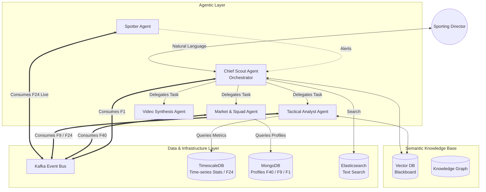
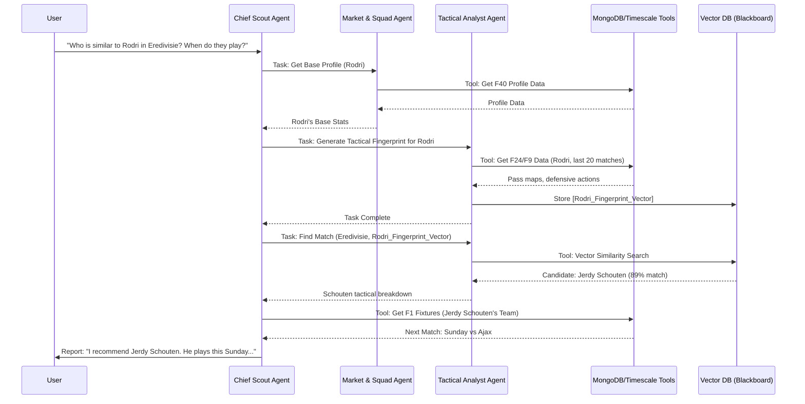

# Scout Pro: Multi-Agent System (MAS) Architecture and Feature Plan

## 1. Executive Summary

This document outlines the architectural transformation of Scout Pro from a traditional, static microservices architecture into an autonomous, proactive Multi-Agent System (MAS). 

The current system relies on passive services (e.g., `player-service`, `match-service`) that wait for human API calls to retrieve or process data. While the previous architecture successfully ingested live events (Opta F24), it lacked the autonomy to correlate that live data with broader historical and structural contexts (e.g., Opta F1 Match Fixtures, F9 Match Results/Summaries, and F40 Squad/Player Profiles).

The MAS paradigm introduces specialized AI agents that continuously monitor all data streams (historical, structural, and live). These agents collaborate to generate insights and proactively alert scouting staff to market inefficiencies or tactical trends, mirroring a real-world football scouting operations team.

## 2. Core Architectural Shifts

| Concept | Current (Microservices) | Future (Multi-Agent System) |
| :--- | :--- | :--- |
| **Data Trigger** | User initiates search/request | Agents react to real-time events and scheduled bulk data (Kafka) |
| **Logic** | Imperative CRUD and fixed algorithms | Goal-oriented LLM orchestration (Reasoning) |
| **Communication** | Synchronous REST / Pub-Sub data passing | Agent-to-Agent negotiation & Blackboard (Shared Memory) |
| **Output** | Raw statistics & dashboards | Synthesized scouting reports, alerts, and video reels |

### 2.1 The Agent Roster and Data Context

We define specific agents, each encapsulated within its own service boundary, equipped with specialized tools and system prompts. Crucially, each agent is responsible for synthesizing overlapping feeds from Opta (F1, F9, F24, F40) and StatsBomb.

1.  **Chief Scout Agent (Orchestrator):** 
    *   **Role:** The primary user interface and task delegator. Deconstructs complex natural language queries (e.g., *"Find a left-footed passing CB under 23 playing tomorrow"*).
    *   **Data Context:** Consumes **Opta F1 (Match Fixtures/Schedules)** to plan automated scouting tasks and know when target players are actively playing.
2.  **The Spotter Agent (Live Data Monitor):** 
    *   **Role:** Autonomously monitors live match streams and triggers alerts when abnormal thresholds are breached.
    *   **Data Context:** Subscribes exclusively to **Opta F24 (Live Event Data)** and StatsBomb 360 live feeds via Kafka. Translates raw actions (x/y coordinates) into sudden performance spikes.
3.  **Tactical Analyst Agent:** 
    *   **Role:** Deduces tactical systems and overarching player impact over a period of time. Understands PPDA, xT (Expected Threat), and pass network shapes.
    *   **Data Context:** Correlates **Opta F24 (Events)** with **Opta F9 (Post-Match Summaries/Stats)**. Uses the F9 data to calibrate its understanding of match outcomes and broader team statistics before diving into the granular F24 event sequences.
4.  **Market Valuation & Squad Agent:** 
    *   **Role:** Cross-references player performance with squad dynamics, age profiles, and contract data to identify undervalued targets.
    *   **Data Context:** Heavily relies on **Opta F40 (Squad Lists & Player Profiles)**. It tracks shifts in team rosters, playing time distribution, and physical profiles over seasons.
5.  **Video Synthesis Agent:** 
    *   **Role:** Correlates tactical insights with video timestamps to generate evidence-backed video scout reports.
    *   **Data Context:** Links F24 timestamps with internal or third-party video repository IDs.

---

## 3. High-Level System Architecture

The MAS is built on top of our existing robust infrastructure (Kafka, TimescaleDB, MongoDB), integrating multiple Opta feeds seamlessly.



## 4. Agent Interaction Workflow (Example)

**Scenario:** The user asks, *"Who is the most tactically similar player to Rodri in the Eredivisie, and when do they play next?"*



## 5. Implementation & Feature Plan

### Phase 1: Foundation & Feed Normalization (Weeks 1-2)
*   **Goal:** Establish the LLM Gateway, Vector Database, and ensure all Opta feeds are available to agents.
*   **Actions:**
    *   Deploy a central inference gateway service (e.g., using LiteLLM) to manage OpenAI/Anthropic API keys.
    *   Ensure Kafka topics for non-live Opta feeds (**F1**, **F9**, **F40**) are correctly configured alongside the existing **F24** pipeline.
    *   Deploy Qdrant or ChromaDB as the Agent Blackboard for shared memory.
    *   Wrap existing data access logic into LLM-callable tools (e.g., `FetchF40PlayerProfile`, `FetchF1TeamFixtures`).

### Phase 2: The Chief Scout & Orchestration (Weeks 3-4)
*   **Goal:** Enable natural language querying, utilizing F1 scheduling data for scouting planning.
*   **Actions:**
    *   Develop the **Chief Scout Agent** service with a ReAct reasoning loop.
    *   Give the Chief Scout access to `Opta F1` tools so it can answer scheduling and fixture-related questions natively.
    *   Update the React frontend with a chat interface.

### Phase 3: Analytical & Market Agents (Weeks 5-7)
*   **Goal:** Introduce deep reasoning over combined event (F24), historical (F9), and structural (F40) data.
*   **Actions:**
    *   Develop the **Tactical Analyst Agent** with tools to parse both structured match summaries (F9) and granular event series (F24) from TimescaleDB.
    *   Develop the **Market & Squad Agent** referencing player registries and team squads (F40) to determine squad depth and market gaps.
    *   Develop the **Spotter Agent** listening strictly to F24 live data for immediate in-game alerts.

### Phase 4: Synthesis & Autonomous Workflows (Weeks 8-10)
*   **Goal:** Fully autonomous scouting report generation and video mapping.
*   **Actions:**
    *   Develop the **Video Synthesis Agent** to receive timestamps from the Tactical Analyst and return pre-cut video stream links.
    *   Implement cron-based autonomous market scans. (e.g., "Scan F40 profiles in South America for newly registered U20 players, cross-reference their F9 stats").

## 6. Agent Internal Architecture & Sub-Components

To maintain **Clean Architecture**, each Agent Service is structurally independent. They are built around an **Agent Core** (the LLM reasoning engine) surrounded by concentric layers: memory management, tool execution, and external communication adapters (Kafka/REST/WebSockets).

### 6.1 Generic Agent Topology

```mermaid
flowchart TD
    subgraph Framework/Driver Layer
        Kafka[Kafka Event Bus]
        DB[(Timescale/MongoDB)]
        VDB[(Vector Database)]
        LLM[LLM API Gateway]
    end

    subgraph Agent Boundary
        subgraph Interface Adapters
            Consumer[Kafka Consumer]
            Producer[Kafka Producer]
            WS[WebSocket/REST API]
        end
        
        subgraph Tooling Layer
            DBC[Database Clients]
            Search[Search APIs]
        end

        subgraph Core Logic Layer
            Router[Prompt/Task Router]
            Memory[Context & Memory Manager]
            State[State/Session Cache]
            ReAct[ReAct Reasoning Loop]
        end
    end

    %% Wiring
    Consumer --> Router
    WS --> Router
    Router <--> ReAct
    ReAct <--> Memory
    ReAct <--> State
    ReAct --> Producer
    
    %% To external
    ReAct -.->|Invokes| Tooling Layer
    Tooling Layer -.-> DB
    Memory -.-> VDB
    ReAct -.-> LLM
```

### 6.2 Detailed Agent Sub-Components

Each specialized agent implements the core architecture above, but utilizes distinct sub-components, tools, and system prompts tailored to its domain within the scouting department.

#### 1. Chief Scout Agent (The Orchestrator)
*   **Role:** User-facing conversational gateway and tactical planner.
*   **Core Logic:** Master Planner (Hierarchical Task Networking). Breaks down a user prompt into a sequential tree of tasks for sub-agents.
*   **Sub-Components:**
    *   *Natural Language Processor (NLP):* Extracts intent, named entities (players, teams, competitions), and implicit constraints.
    *   *Delegation Engine:* Publishes task events to Kafka (e.g., `AnalyzePlayerTactics(PlayerID)`) targeted at specific subordinate agents.
    *   *Synthesis Engine:* Aggregates responses from the Blackboard (Vector DB) and subordinate agents into a coherent, executive summary.
    *   *Session Memory:* Maintains conversational state via Redis for follow-up questions (e.g., *"What about his injury record?"*).
*   **Tools Pipeline:** ElasticSearch Client (for fuzzy-matching player names quickly), Opta F1 Reader (to check future match fixtures for scouting trips).

#### 2. Spotter Agent (Live Data Monitor)
*   **Role:** Reactive alert generator based on active matches. Needs ultra-low latency, so it avoids heavy LLM calls until a threshold is met.
*   **Core Logic:** Stream Processing & Anomaly Detection.
*   **Sub-Components:**
    *   *F24 Stream Processor:* Consumes live XML/JSON Opta F24 events as they happen from Kafka.
    *   *State Cache (In-Memory):* Tracks running tallies (e.g., progressive passes made in the last 15 minutes) using Redis.
    *   *Threshold Evaluator:* A deterministic rule engine (Classic Code) that triggers when a player outperforms a dynamic baseline.
    *   *Alert Generator:* Once triggered, uses a lightweight LLM prompt to generate a human-readable alert (e.g., *"Look out, X is dominating the half-spaces right now"*).
*   **Tools Pipeline:** TimescaleDB writer (to log the live metric), WebSocket Broadcaster (to push to the UI).

#### 3. Tactical Analyst Agent
*   **Role:** Deep analytical reasoning over match data to establish play-styles and event mapping.
*   **Core Logic:** Pattern Recognition and Vector Embedding.
*   **Sub-Components:**
    *   *Context Loader:* Pre-loads the Opta F9 (Match Summary) to understand the final outcome, formations, and general stats before diving into events.
    *   *Sequence Analyzer:* Groups F24 isolated events into logical possession chains (e.g., "Build-up from the back leading to a shot").
    *   *Metric Calculator:* Computes advanced metrics logically (e.g., PPDA, xT) using predefined mathematical libraries before feeding the result to the LLM.
    *   *Fingerprint Generator:* An LLM sub-component that translates the calculated metrics and pass maps into a high-dimensional "Tactical Profile Vector".
*   **Tools Pipeline:** TimescaleDB Client (Fetch last N matches of F24 data), Blackboard Writer (Stores the Tactical Profile Vector for similarity matching).

#### 4. Market & Squad Agent
*   **Role:** Evaluates contract efficiency, age curves, and market opportunities.
*   **Core Logic:** Comparative Matrix & Lifecycle Modeling.
*   **Sub-Components:**
    *   *F40 Profile Tracker:* Continuously ingests Opta F40 (Squad Lists) to track changes in team compositions globally.
    *   *Valuation Engine:* Cross-references qualitative performance data from the Blackboard against remaining contract length.
    *   *Roster Profiler:* Maps out a team's positional depth chart (e.g., identifying heavily aging squads that will desperately need a CB next window).
*   **Tools Pipeline:** MongoDB Client (Core Player/Team entities), Third-party Financial Integration Tool (if Transfermarkt or Capology APIs are used).

#### 5. Video Synthesis Agent
*   **Role:** Links data events back to verifiable visual proof.
*   **Core Logic:** Timeline Compilation.
*   **Sub-Components:**
    *   *Timestamp Mapper:* Translates Opta F24 `period_id`, `min`, `sec` into absolute video timestamps (considering half-time delays and VAR stoppages).
    *   *Playlist Generator:* Groups multiple scattered timestamps into a cohesive "Highlight Reel" continuous JSON/XML payload.
    *   *Visual Context Explainer:* Generates localized text overlays based on the Tactical Agent's findings (e.g., "Rodri triggers the press here" overlay at `04:12`).
*   **Tools Pipeline:** Third-party Video Provider API (e.g., Hudl, Wyscout, or internal video repository), WebSocket Notifier (to deliver the link to the Chief Scout).

## 7. Migration Strategy

The MAS will complement, not immediately replace, the existing APIs. The standard React UI (dashboards, player profiles) will continue to use the traditional REST APIs (`/api/v2/*`). 
The agentic system will be exposed via a new conversational UI layer and an alerts panel, gradually automating the manual evaluation tasks currently performed by club staff.
