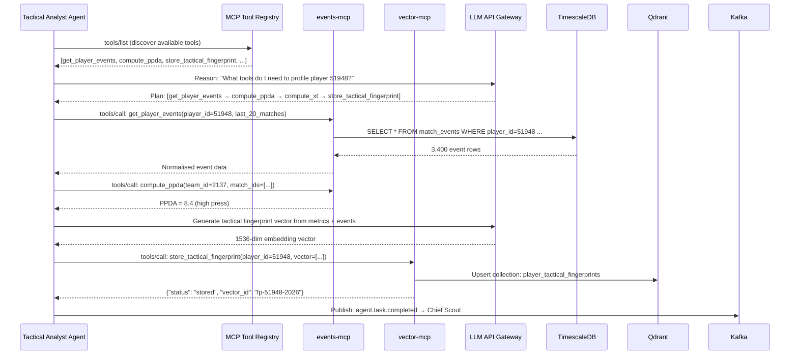
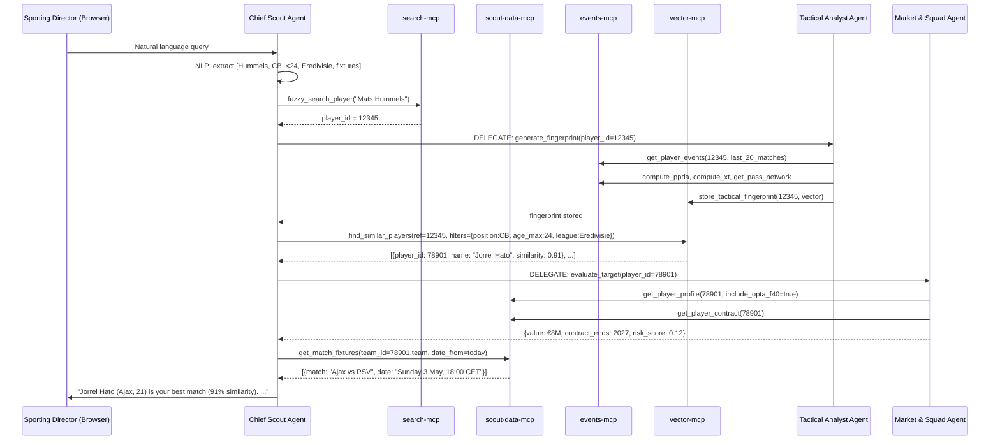

# Scout Pro: MCP-Powered Multi-Agent System Architecture

**Version:** 1.0  
**Date:** April 30, 2026  
**Status:** Design Blueprint

---

## 1. Executive Summary

This document describes how to integrate **Model Context Protocol (MCP)** servers into the existing Scout Pro multi-agent system to create a fully autonomous, AI-native football scouting platform.

**The core problem** with the current MAS design is tight coupling: each agent embeds its own custom database clients, Kafka consumers, and API adapters. This creates duplicated infrastructure logic, makes agents brittle to infrastructure changes, and prevents dynamic tool discovery across agents.

**The solution** is to introduce an **MCP Server Layer** — a set of standardised tool-servers sitting between the existing Scout Pro infrastructure (Kafka, MongoDB, TimescaleDB, Elasticsearch, Redis, Vector DB) and all AI agents. Agents discover and invoke these tools via the open MCP protocol, making the system composable, observable, and upgradeable without rewriting agent logic.

---

## 2. The Model Context Protocol (MCP) in Context

MCP is an open standard (Anthropic, 2024) that defines how a language model host (an agent) connects to external **tool servers**. Each MCP server exposes a set of callable **Tools**, **Resources**, and **Prompts** that the agent can discover at runtime.

```
┌─────────────────────────────────────────────────────────────────┐
│              What MCP Gives Us                                  │
├───────────────────┬─────────────────────────────────────────────┤
│ Without MCP       │ With MCP                                    │
├───────────────────┼─────────────────────────────────────────────┤
│ Each agent has    │ Agents share a common MCP tool registry     │
│ its own DB client │                                             │
│                   │                                             │
│ Hardcoded API     │ Agents discover tools dynamically at        │
│ endpoints in code │ runtime via MCP protocol                    │
│                   │                                             │
│ No observability  │ Every tool call is logged and traceable     │
│ of agent actions  │ via MCP protocol layer                      │
│                   │                                             │
│ Changing DB means │ Only the MCP server changes; agents are     │
│ updating N agents │ unaffected                                  │
└───────────────────┴─────────────────────────────────────────────┘
```

---

## 3. Complete System Architecture

This is the full picture — from a scout's browser tab to a MongoDB document — with all three architectural layers.

```
╔══════════════════════════════════════════════════════════════════════════════╗
║                         SCOUT PRO — MCP AGENTIC ARCHITECTURE                ║
╠══════════════════════════════════════════════════════════════════════════════╣
║                                                                              ║
║   ┌─────────────────────────────────────────────────────────────────────┐   ║
║   │                  LAYER 1: PRESENTATION LAYER                        │   ║
║   │                                                                     │   ║
║   │   React Frontend (Port 5173)                                        │   ║
║   │   ┌──────────────┐  ┌──────────────┐  ┌──────────────────────────┐ │   ║
║   │   │  Dashboard   │  │  Player /    │  │  ★ AI Scout Chat UI      │ │   ║
║   │   │  Dashboards  │  │  Match Views │  │  (New — natural language) │ │   ║
║   │   └──────────────┘  └──────────────┘  └──────────────────────────┘ │   ║
║   └─────────────────────────────────┬───────────────────────────────────┘   ║
║                           REST/WebSocket                                     ║
║   ┌─────────────────────────────────▼───────────────────────────────────┐   ║
║   │                  NGINX API Gateway  (Port 80)                        │   ║
║   │   /api/v1/* → Existing Services  │  /api/agent/* → Agent Gateway   │   ║
║   └──────────────────────────────────┬──────────────────────────────────┘   ║
║                                      │                                       ║
║   ┌─────────────────────────────────▼──────────────────────────────────┐    ║
║   │                  LAYER 2: AGENT ORCHESTRATION LAYER                 │    ║
║   │                                                                     │    ║
║   │  ┌─────────────────────────────────────────────────────────────┐   │    ║
║   │  │  CHIEF SCOUT AGENT  (Orchestrator)          Port: 9000      │   │    ║
║   │  │  ┌──────────────┐  ┌──────────────┐  ┌──────────────────┐  │   │    ║
║   │  │  │ NL Processor │  │ Task Planner │  │ Synthesis Engine │  │   │    ║
║   │  │  │ (Intent/NER) │  │ (HTN / ReAct)│  │ (Report Builder) │  │   │    ║
║   │  │  └──────────────┘  └──────────────┘  └──────────────────┘  │   │    ║
║   │  │            │  Connects to MCP Servers via MCP Protocol      │   │    ║
║   │  └────────────┼────────────────────────────────────────────────┘   │    ║
║   │               │ Kafka: agent.task.* topics (delegate to sub-agents) │   ║
║   │  ┌────────────┼────────────────────────────────────────────────┐   │    ║
║   │  │  SUB-AGENTS (Each is an independent service)                │   │    ║
║   │  │                                                             │   │    ║
║   │  │  ┌────────────────┐  ┌─────────────────┐  ┌────────────┐  │   │    ║
║   │  │  │ Tactical       │  │ Market & Squad  │  │  Spotter   │  │   │    ║
║   │  │  │ Analyst Agent  │  │ Agent           │  │  Agent     │  │   │    ║
║   │  │  │ Port: 9001     │  │ Port: 9002      │  │ Port: 9003 │  │   │    ║
║   │  │  │                │  │                 │  │            │  │   │    ║
║   │  │  │ ReAct Loop     │  │ ReAct Loop      │  │ Rule +     │  │   │    ║
║   │  │  │ + F24/F9 tools │  │ + F40 tools     │  │ LLM Hybrid │  │   │    ║
║   │  │  └────────────────┘  └─────────────────┘  └────────────┘  │   │    ║
║   │  │                                                             │   │    ║
║   │  │  ┌────────────────────────────────────────────────────┐    │   │    ║
║   │  │  │  Video Synthesis Agent              Port: 9004     │    │   │    ║
║   │  │  │  (Timestamp → Video Clip Mapping)                  │    │   │    ║
║   │  │  └────────────────────────────────────────────────────┘    │   │    ║
║   │  └────────────────────────────────────────────────────────────┘   │    ║
║   └─────────────────────────────────────────────────────────────────────┘   ║
║                           ↕  MCP Protocol (JSON-RPC 2.0 / SSE)              ║
║   ┌─────────────────────────────────────────────────────────────────────┐   ║
║   │                  LAYER 3: MCP SERVER LAYER  (NEW)                   │   ║
║   │                                                                     │   ║
║   │  ┌─────────────┐  ┌─────────────┐  ┌─────────────┐  ┌──────────┐  │   ║
║   │  │ scout-data  │  │ events-mcp  │  │ search-mcp  │  │ live-mcp │  │   ║
║   │  │ -mcp        │  │ (TimescaleDB│  │ (Elastic-   │  │ (Kafka   │  │   ║
║   │  │ (MongoDB)   │  │ + F24/F9)   │  │ search)     │  │ F24 Live)│  │   ║
║   │  │ Port: 9100  │  │ Port: 9101  │  │ Port: 9102  │  │ Port:9103│  │   ║
║   │  └─────────────┘  └─────────────┘  └─────────────┘  └──────────┘  │   ║
║   │                                                                     │   ║
║   │  ┌─────────────┐  ┌─────────────┐  ┌────────────────────────────┐  │   ║
║   │  │ vector-mcp  │  │ ml-mcp      │  │ video-mcp                  │  │   ║
║   │  │ (Qdrant /   │  │ (ML Service │  │ (Video Service + Hudl/     │  │   ║
║   │  │ ChromaDB)   │  │ predictions)│  │ Wyscout adapters)          │  │   ║
║   │  │ Port: 9104  │  │ Port: 9105  │  │ Port: 9106                 │  │   ║
║   │  └─────────────┘  └─────────────┘  └────────────────────────────┘  │   ║
║   └─────────────────────────────────────────────────────────────────────┘   ║
║                           ↕  Native Protocols                                ║
║   ┌─────────────────────────────────────────────────────────────────────┐   ║
║   │                  LAYER 4: EXISTING INFRASTRUCTURE                   │   ║
║   │                                                                     │   ║
║   │  ┌──────────┐  ┌────────────┐  ┌──────────┐  ┌────────────────┐   │   ║
║   │  │ MongoDB  │  │TimescaleDB │  │  Redis   │  │ Elasticsearch  │   │   ║
║   │  │ :27017   │  │  :5432     │  │  :6379   │  │     :9200      │   │   ║
║   │  └──────────┘  └────────────┘  └──────────┘  └────────────────┘   │   ║
║   │                                                                     │   ║
║   │  ┌──────────┐  ┌────────────┐  ┌────────────────────────────────┐  │   ║
║   │  │  Kafka   │  │  Qdrant /  │  │  Existing Backend Services     │  │   ║
║   │  │  :9092   │  │  ChromaDB  │  │  (Player :8001, Match :8003,   │  │   ║
║   │  │          │  │  :6333     │  │   ML :8005, Analytics :8012)   │  │   ║
║   │  └──────────┘  └────────────┘  └────────────────────────────────┘  │   ║
║   └─────────────────────────────────────────────────────────────────────┘   ║
╚══════════════════════════════════════════════════════════════════════════════╝
```

---

## 4. MCP Server Specifications

Each MCP server is a lightweight service that wraps one infrastructure component and exposes domain-specific tools. It communicates with agents using **JSON-RPC 2.0** over **HTTP with Server-Sent Events (SSE)** for streaming.

### 4.1 `scout-data-mcp` — MongoDB Wrapper

Wraps: `MongoDB (:27017)` — players, teams, matches, F1/F9/F40 Opta feeds

| Tool Name | Parameters | Returns | Used By |
|---|---|---|---|
| `get_player_profile` | `player_id`, `include_opta_f40` | Full player entity + F40 data | Chief Scout, Market Agent |
| `get_team_squad` | `team_id`, `season` | Opta F40 squad list | Market Agent |
| `get_match_fixtures` | `competition_id`, `season`, `date_from` | Opta F1 fixture schedule | Chief Scout |
| `get_match_summary` | `match_id` | Opta F9 post-match result + stats | Tactical Agent |
| `search_players_by_profile` | `position`, `age_max`, `nationality` | Matching player list | Market Agent, Chief Scout |
| `get_player_contract` | `player_id` | Contract + valuation metadata | Market Agent |

```json
// Example MCP Tool Call (JSON-RPC 2.0)
{
  "jsonrpc": "2.0",
  "method": "tools/call",
  "id": "req-001",
  "params": {
    "name": "get_player_profile",
    "arguments": {
      "player_id": 51948,
      "include_opta_f40": true
    }
  }
}
```

---

### 4.2 `events-mcp` — TimescaleDB Wrapper

Wraps: `TimescaleDB (:5432)` — match_events, player_stats_timeseries, team_stats

| Tool Name | Parameters | Returns | Used By |
|---|---|---|---|
| `get_player_events` | `player_id`, `match_ids[]`, `event_types[]` | F24 event rows | Tactical Agent |
| `get_player_time_series` | `player_id`, `season`, `window_days` | Time-bucketed stat aggregates | Tactical Agent, Spotter |
| `get_match_events` | `match_id`, `period`, `team_id` | Full F24 event sequence | Tactical Agent |
| `compute_ppda` | `team_id`, `match_ids[]` | PPDA value (defensive intensity) | Tactical Agent |
| `compute_xt` | `player_id`, `match_ids[]` | Expected Threat values | Tactical Agent |
| `get_pass_network` | `team_id`, `match_id` | Pass network adjacency matrix | Tactical Agent |
| `get_heatmap_data` | `player_id`, `event_type`, `match_ids[]` | Bucketed x/y coordinates | Tactical Agent, Video Agent |

---

### 4.3 `search-mcp` — Elasticsearch Wrapper

Wraps: `Elasticsearch (:9200)` — players, teams, matches indices

| Tool Name | Parameters | Returns | Used By |
|---|---|---|---|
| `fuzzy_search_player` | `name_query`, `competition`, `limit` | Ranked player list with fuzzy match score | Chief Scout |
| `search_teams` | `name_query`, `country`, `league` | Team list | Chief Scout, Market Agent |
| `full_text_match_search` | `query_text`, `date_range` | Match documents | Chief Scout |
| `semantic_player_search` | `description` (NL) | Matched players (embedding-based) | Chief Scout |

---

### 4.4 `live-mcp` — Kafka Live Feed Wrapper

Wraps: `Kafka (:9092)` — topics: `match.live.updates`, `match.goal.scored`, `opta.f24.live`

| Tool Name | Parameters | Returns | Used By |
|---|---|---|---|
| `subscribe_live_match` | `match_id`, `callback_url` | SSE stream of F24 events | Spotter Agent |
| `get_live_player_stats` | `player_id`, `match_id` | Running in-match stats | Spotter Agent |
| `get_active_matches` | `competition_id` | Currently live match list | Spotter Agent, Chief Scout |
| `get_live_event_window` | `match_id`, `last_n_minutes` | Last N minutes of F24 events | Spotter Agent |

---

### 4.5 `vector-mcp` — Agent Blackboard (Qdrant / ChromaDB)

Wraps: `Qdrant or ChromaDB (:6333)` — collections: `player_tactical_fingerprints`, `match_embeddings`, `scout_reports`

| Tool Name | Parameters | Returns | Used By |
|---|---|---|---|
| `store_tactical_fingerprint` | `player_id`, `vector[]`, `metadata` | Stored vector ID | Tactical Agent |
| `find_similar_players` | `reference_player_id`, `top_k`, `filters` | Ranked similar players + similarity score | Chief Scout, Tactical Agent |
| `store_scout_report` | `report_id`, `embedding[]`, `text` | Stored report ID | Chief Scout |
| `semantic_search_reports` | `query_embedding[]`, `top_k` | Past scouting reports | Chief Scout |
| `get_player_fingerprint` | `player_id` | Stored tactical vector + metadata | Tactical Agent |

---

### 4.6 `ml-mcp` — ML Service Wrapper

Wraps: `ML Service (:8005)` — model predictions, performance projections

| Tool Name | Parameters | Returns | Used By |
|---|---|---|---|
| `predict_player_performance` | `player_id`, `season_target` | Projected rating + confidence interval | Market Agent |
| `classify_playing_style` | `player_id`, `event_data` | Style cluster (e.g., "Ball-playing CB") | Tactical Agent |
| `injury_risk_score` | `player_id` | Risk score 0-1 | Market Agent, Chief Scout |
| `market_value_estimate` | `player_id`, `performance_data` | Estimated transfer value | Market Agent |

---

### 4.7 `video-mcp` — Video Service Wrapper

Wraps: `Video Service (:8011)` + external providers (Hudl, Wyscout)

| Tool Name | Parameters | Returns | Used By |
|---|---|---|---|
| `get_video_timestamp` | `match_id`, `period`, `minute`, `second` | Absolute video timestamp (ms) | Video Agent |
| `get_event_clip_url` | `match_id`, `event_id`, `padding_secs` | Pre-signed clip URL | Video Agent |
| `create_highlight_reel` | `clip_ids[]`, `transitions`, `overlays` | Compiled highlight reel URL | Video Agent |
| `annotate_clip` | `clip_id`, `annotations[]` | Annotated clip URL | Video Agent |

---

## 5. Agent-to-MCP Integration Flow

This is how an agent discovers tools and executes a query at runtime.



---

## 6. End-to-End Scenario: Natural Language Scouting Query

**Query:** *"Find a progressive CB under 24 similar to Mats Hummels, playing in the Eredivisie, and tell me when they play next."*



---

## 7. MCP Server Internal Architecture

Each MCP server follows a consistent internal structure to ensure clean architecture and replaceability.

```
┌─────────────────────────────────────────────────────────────────┐
│                  Generic MCP Server (e.g., events-mcp)          │
│                                                                  │
│  ┌────────────────────────────────────────────────────────────┐  │
│  │  MCP Interface Layer (JSON-RPC 2.0 / HTTP+SSE)            │  │
│  │  • tools/list  → returns tool schemas                     │  │
│  │  • tools/call  → routes to tool handler                   │  │
│  │  • resources/* → exposes read-only data resources         │  │
│  └───────────────────────────┬────────────────────────────────┘  │
│                              │                                   │
│  ┌───────────────────────────▼────────────────────────────────┐  │
│  │  Tool Registry (Auto-discovered from handler classes)      │  │
│  │  • Tool schema definitions (JSON Schema for inputs)        │  │
│  │  • Input validation                                        │  │
│  │  • Output serialisation                                    │  │
│  └───────────────────────────┬────────────────────────────────┘  │
│                              │                                   │
│  ┌───────────────────────────▼────────────────────────────────┐  │
│  │  Domain Tool Handlers                                      │  │
│  │  • get_player_events()   (queries TimescaleDB)             │  │
│  │  • compute_ppda()        (in-process calculation)          │  │
│  │  • get_pass_network()    (query + graph construction)      │  │
│  └───────────────────────────┬────────────────────────────────┘  │
│                              │                                   │
│  ┌───────────────────────────▼────────────────────────────────┐  │
│  │  Infrastructure Adapter                                    │  │
│  │  • TimescaleDB connection pool                             │  │
│  │  • Query builders (parameterised — no SQL injection)       │  │
│  │  • Result caching (Redis)                                  │  │
│  └────────────────────────────────────────────────────────────┘  │
└─────────────────────────────────────────────────────────────────┘
```

**Technology choice:** Python with the `mcp` SDK (or `fastmcp`) provides the fastest path to production for this stack.

---

## 8. Agent Internal Architecture (Clean Architecture View)

Each agent service follows the same layered pattern, communicating exclusively through MCP tools and Kafka events.

```
┌──────────────────────────────────────────────────────────────────┐
│                    AGENT SERVICE BOUNDARY                         │
│  (e.g., Tactical Analyst Agent — Port 9001)                      │
│                                                                   │
│  ┌─────────────────────────────────────────────────────────────┐  │
│  │  DRIVING ADAPTERS (Inbound)                                 │  │
│  │  • Kafka Consumer: listens to agent.task.tactical.*         │  │
│  │  • REST API: POST /analyze (direct orchestrator call)       │  │
│  └─────────────────────────────┬───────────────────────────────┘  │
│                                │                                  │
│  ┌─────────────────────────────▼───────────────────────────────┐  │
│  │  AGENT CORE (Use Cases / Application Logic)                 │  │
│  │                                                             │  │
│  │  ┌────────────────┐  ┌──────────────┐  ┌────────────────┐  │  │
│  │  │  Task Router   │  │ Context &    │  │ ReAct Reasoning│  │  │
│  │  │  (Deconstructs │  │ Memory Mgr   │  │ Loop           │  │  │
│  │  │   incoming task│  │ (Redis +     │  │ (Observe →     │  │  │
│  │  │   into steps)  │  │  in-memory)  │  │  Think → Act)  │  │  │
│  │  └────────────────┘  └──────────────┘  └────────────────┘  │  │
│  │                                 │                            │  │
│  │                          LLM API calls                       │  │
│  └─────────────────────────────────┬───────────────────────────┘  │
│                                    │                              │
│  ┌─────────────────────────────────▼───────────────────────────┐  │
│  │  MCP CLIENT LAYER (Tool Execution)                          │  │
│  │  • MCP Client: auto-discovers tools from MCP servers        │  │
│  │  • Calls: events-mcp, vector-mcp, scout-data-mcp           │  │
│  │  • All calls are logged, traced (OpenTelemetry)             │  │
│  └─────────────────────────────────┬───────────────────────────┘  │
│                                    │                              │
│  ┌─────────────────────────────────▼───────────────────────────┐  │
│  │  DRIVEN ADAPTERS (Outbound)                                 │  │
│  │  • Kafka Producer: publishes agent.task.completed           │  │
│  │  • WebSocket: pushes alerts to frontend (via WS Server)     │  │
│  └─────────────────────────────────────────────────────────────┘  │
└──────────────────────────────────────────────────────────────────┘
```

---

## 9. Data Flow: From Raw Opta Feed to Scout Report

```
Opta Data Files          MCP Layer               Agents                UI
(F1, F9, F24, F40)                                                       
        │                                                                
        ▼                                                                
┌──────────────────┐                                                     
│ Live Ingestion   │                                                     
│ Service (:8006)  │                                                     
│  Parses F24 XML  │                                                     
│  → Kafka topic   │                                                     
│  → TimescaleDB   │                                                     
│  → MongoDB       │                                                     
└─────────┬────────┘                                                     
          │                                                              
          ▼                                                              
    ┌─────────┐     ┌─────────────────┐    ┌──────────────────┐         
    │Kafka    │────▶│  live-mcp       │───▶│  Spotter Agent   │────▶ Alert
    │F24 live │     │  (subscribe &   │    │  (rule engine +  │     via WS
    └─────────┘     │   buffer)       │    │   LLM alert gen) │         
                    └─────────────────┘    └──────────────────┘         
                                                                         
    ┌─────────┐     ┌─────────────────┐    ┌──────────────────┐         
    │Timescale│────▶│  events-mcp     │───▶│  Tactical Analyst│────▶ Vector
    │DB       │     │  (query + calc) │    │  Agent           │     DB store
    └─────────┘     └─────────────────┘    └──────────────────┘         
                                                                         
    ┌─────────┐     ┌─────────────────┐    ┌──────────────────┐         
    │MongoDB  │────▶│  scout-data-mcp │───▶│  Market & Squad  │────▶ Chief
    │         │     │  (profiles +    │    │  Agent           │     Scout
    └─────────┘     │   fixtures)     │    └──────────────────┘         
                    └─────────────────┘                                  
                                                                         
    ┌─────────┐     ┌─────────────────┐    ┌──────────────────┐         
    │Qdrant/  │────▶│  vector-mcp     │◀──▶│  Chief Scout     │────▶ Report
    │ChromaDB │     │  (blackboard)   │    │  Agent           │     to UI
    └─────────┘     └─────────────────┘    └──────────────────┘         
```

---

## 10. New Components Required

The following new services need to be added alongside the existing 13 backend services.

| Component | Type | Port | Technology | Priority |
|---|---|---|---|---|
| **Chief Scout Agent** | Agent Service | 9000 | Python + `mcp` SDK + LLM | P0 — Core |
| **Tactical Analyst Agent** | Agent Service | 9001 | Python + `mcp` SDK + LLM | P0 — Core |
| **Market & Squad Agent** | Agent Service | 9002 | Python + `mcp` SDK + LLM | P1 |
| **Spotter Agent** | Agent Service | 9003 | Python + Kafka + lightweight LLM | P1 |
| **Video Synthesis Agent** | Agent Service | 9004 | Python + `mcp` SDK | P2 |
| **scout-data-mcp** | MCP Server | 9100 | Python `fastmcp` + PyMongo | P0 — Core |
| **events-mcp** | MCP Server | 9101 | Python `fastmcp` + asyncpg | P0 — Core |
| **search-mcp** | MCP Server | 9102 | Python `fastmcp` + elasticsearch-py | P1 |
| **live-mcp** | MCP Server | 9103 | Python `fastmcp` + aiokafka | P1 |
| **vector-mcp** | MCP Server | 9104 | Python `fastmcp` + qdrant-client | P0 — Core |
| **ml-mcp** | MCP Server | 9105 | Python `fastmcp` (wraps :8005) | P2 |
| **video-mcp** | MCP Server | 9106 | Python `fastmcp` (wraps :8011) | P2 |
| **LLM Gateway** | Infra Service | 9200 | LiteLLM (OpenAI/Anthropic proxy) | P0 — Core |
| **Vector DB** | Infra Service | 6333 | Qdrant | P0 — Core |
| **AI Scout Chat UI** | Frontend Component | — | React + TypeScript | P1 |

---

## 11. Frontend Integration: AI Scout Chat Panel

The Chat UI is a new panel in the React frontend that connects to the Chief Scout Agent via WebSocket. It renders the agent's reasoning steps, intermediate tool calls, and final synthesised report.

```
┌──────────────────────────────────────────────────────────────────┐
│  AI Scout Panel (React Component)                                │
│                                                                  │
│  ┌──────────────────────────────────────────────────────────┐   │
│  │  Chat History                                            │   │
│  │  ┌────────────────────────────────────────────────────┐  │   │
│  │  │ You: "Find a CB under 24 similar to Hummels..."    │  │   │
│  │  └────────────────────────────────────────────────────┘  │   │
│  │  ┌────────────────────────────────────────────────────┐  │   │
│  │  │ Agent: [thinking] Searching for Hummels profile... │  │   │
│  │  │        [tool] get_player_events ✓                  │  │   │
│  │  │        [tool] compute_ppda ✓                       │  │   │
│  │  │        [tool] find_similar_players ✓               │  │   │
│  │  │        ─────────────────────────────               │  │   │
│  │  │        Jorrel Hato (Ajax, 21) — 91% match          │  │   │
│  │  │        Next match: Sunday 3 May vs PSV, 18:00 CET  │  │   │
│  │  │        Market value: €8M | Contract: 2027          │  │   │
│  │  └────────────────────────────────────────────────────┘  │   │
│  └──────────────────────────────────────────────────────────┘   │
│                                                                  │
│  ┌────────────────────────────────────────────────────────────┐  │
│  │  Type your scouting query...                    [Send] ▶   │  │
│  └────────────────────────────────────────────────────────────┘  │
│                                                                  │
│  Active Alerts (Spotter Agent):                                  │
│  ⚡ [LIVE] Player #7 has 12 progressive passes in 25 min         │
└──────────────────────────────────────────────────────────────────┘
```

**WebSocket message contract:**
```typescript
// Agent → Frontend (streaming token)
interface AgentMessage {
  type: "thinking" | "tool_call" | "tool_result" | "final_answer" | "alert";
  content: string;
  tool?: { name: string; args: Record<string, unknown>; result?: unknown };
  timestamp: string;
  agent: "chief_scout" | "tactical" | "market" | "spotter";
}
```

---

## 12. Implementation Phases

### Phase 0 — Foundations (Week 1)
- [ ] Deploy **Qdrant** as Vector DB (add to `docker-compose.yml`)
- [ ] Deploy **LiteLLM gateway** with OpenAI/Anthropic API key management
- [ ] Install `fastmcp` (Python MCP SDK) as shared dependency
- [ ] Add `9100-9106` port range to NGINX routing config

### Phase 1 — Core MCP Servers (Week 2–3)
- [ ] Implement **`scout-data-mcp`** (MongoDB tools — player, team, fixtures)
- [ ] Implement **`events-mcp`** (TimescaleDB tools — F24 events, PPDA, xT)
- [ ] Implement **`vector-mcp`** (Qdrant tools — store and query fingerprints)
- [ ] Write integration tests for each tool using existing data

### Phase 2 — Chief Scout + Tactical Agents (Week 4–5)
- [ ] Implement **Chief Scout Agent** (orchestrator, ReAct loop, NL interface)
- [ ] Implement **Tactical Analyst Agent** (F24/F9 reasoning, fingerprint generation)
- [ ] Wire agents to MCP servers via `mcp` client SDK
- [ ] Add **AI Scout Chat UI** React component

### Phase 3 — Remaining Agents (Week 6–8)
- [ ] Implement **Market & Squad Agent** (F40, valuation, risk scoring)
- [ ] Implement **Spotter Agent** (live-mcp, Kafka stream, rule engine)
- [ ] Implement **`search-mcp`** and **`live-mcp`**
- [ ] Add alert panel to frontend

### Phase 4 — Video & Autonomy (Week 9–10)
- [ ] Implement **Video Synthesis Agent** and **`video-mcp`**
- [ ] Add autonomous cron-based market scanning jobs to Market Agent
- [ ] Full observability: OpenTelemetry traces through all MCP calls

---

## 13. Key Architectural Decisions

### ADR-001: MCP over Direct DB Access in Agents
**Decision:** Agents must never connect to databases directly. All data access goes through MCP servers.  
**Rationale:** Prevents schema coupling, enables tool-level observability, and allows database migrations without touching agent code.

### ADR-002: ReAct Loop as Standard Agent Reasoning Pattern
**Decision:** All agent core logic uses the ReAct (Reason + Act) loop.  
**Rationale:** Proven pattern for tool-using agents. Provides a structured, traceable reasoning trace that can be shown in the UI ("thinking" steps) and audited by scouting staff.

### ADR-003: Kafka for Agent-to-Agent Communication
**Decision:** Agents communicate asynchronously via Kafka (`agent.task.*` topics), not via direct REST calls between agent services.  
**Rationale:** Maintains loose coupling consistent with the existing event-driven architecture. Prevents the orchestrator from blocking on slow sub-agent responses.

### ADR-004: One MCP Server per Infrastructure Component
**Decision:** Each MCP server wraps exactly one infrastructure system (one DB, one service).  
**Rationale:** Clear blast radius for failures. If Elasticsearch goes down, only `search-mcp` is affected. Agents that don't use search remain operational.

### ADR-005: Vector DB as the Agent Blackboard
**Decision:** Qdrant is used as the shared agent blackboard (shared memory).  
**Rationale:** Enables persistent tactical fingerprints to survive agent restarts. Enables cross-agent knowledge sharing without direct coupling (agents only interact via `vector-mcp`).

---

## 14. Summary: What Each Component Does

```
EXISTING INFRASTRUCTURE          NEW MCP LAYER              NEW AGENT LAYER
═══════════════════════          ═════════════              ═══════════════
MongoDB (profiles, F40/F9/F1) ──▶ scout-data-mcp ──┐
TimescaleDB (F24 events)      ──▶ events-mcp ───────┼──▶ Tactical Analyst Agent
Elasticsearch (text search)   ──▶ search-mcp ───────┤
Kafka (live F24 stream)       ──▶ live-mcp ─────────┼──▶ Spotter Agent
Qdrant (vector blackboard)    ──▶ vector-mcp ───────┼──▶ Chief Scout Agent (uses all)
ML Service (:8005)            ──▶ ml-mcp ───────────┤
Video Service (:8011)         ──▶ video-mcp ────────┘──▶ Video Synthesis Agent
                                                    │
                                   LLM Gateway ─────┘──▶ All agents
                                   (LiteLLM)
```

The MCP layer is the **translation interface** between the existing production infrastructure and the new AI agent layer. It acts as a stable contract boundary — agents speak MCP, infrastructure speaks SQL/MongoDB/Kafka. Neither layer needs to know the other's internal implementation details.
