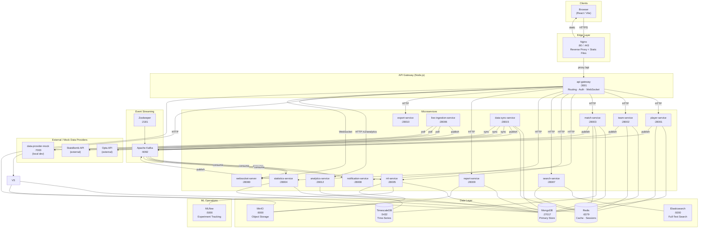
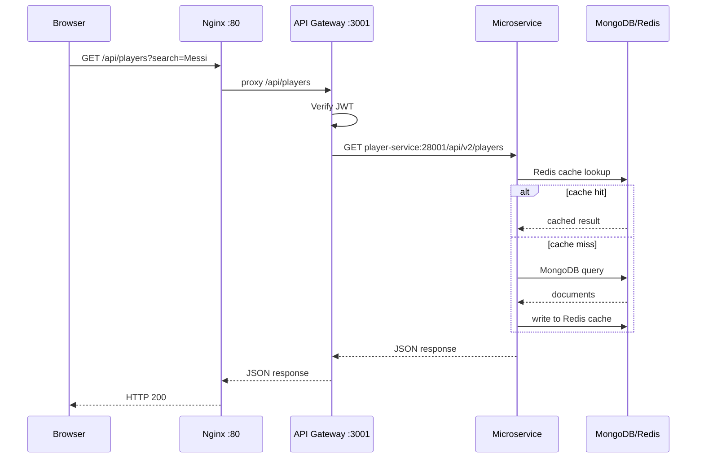
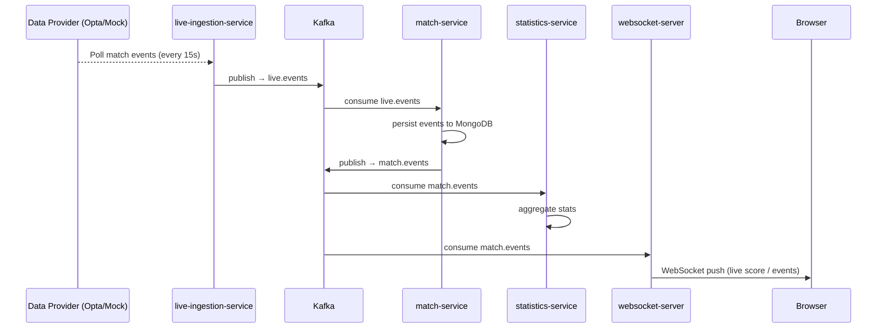
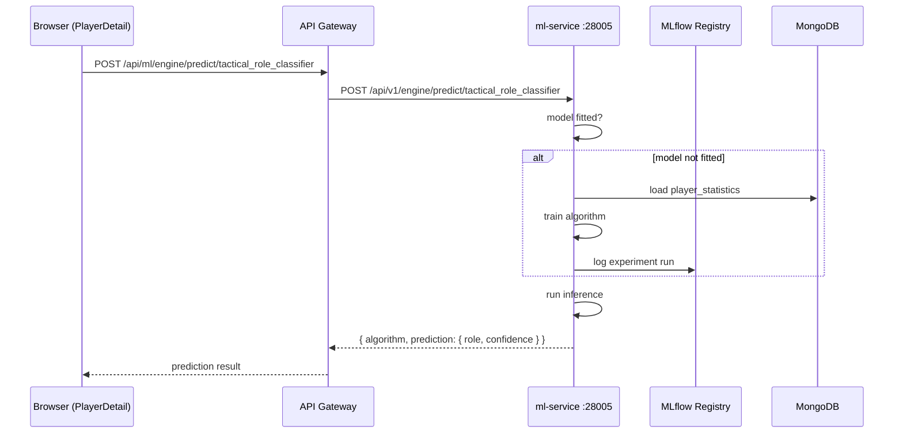
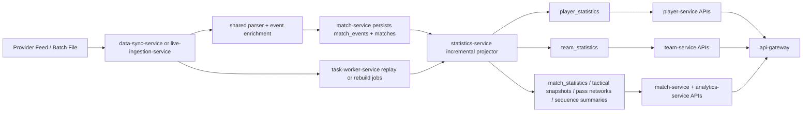

# ScoutPro — System Architecture

Advanced football analytics platform built as a microservices system with real-time event streaming, ML inference, and a React frontend.

---

## High-Level Architecture



---

## Request Flow



---

## Real-Time Data Flow



---

## ML Inference Flow



---

## Services Reference

| Service | External Port | Language | Primary Responsibility |
|---------|--------------|----------|----------------------|
| Nginx | 80, 443 | — | Reverse proxy, serve frontend static files |
| api-gateway | 3001 | Node.js | JWT auth, routing, WebSocket, direct MongoDB access |
| player-service | 28001 | Python (FastAPI) | Player CRUD, profile enrichment, F40/StatsBomb ingestion |
| team-service | 28002 | Python (FastAPI) | Team management, squad composition |
| match-service | 28003 | Python (FastAPI) | Match events, lineups, F24 event storage |
| statistics-service | 28004 | Python (FastAPI) | Aggregated stats, rankings, per-90 metrics |
| ml-service | 28005 | Python (FastAPI) | Tactical role classifier, anomaly detector, fatigue predictor |
| live-ingestion-service | 28006 | Python (FastAPI) | Real-time polling from Opta / StatsBomb / mock |
| search-service | 28007 | Python (FastAPI) | Elasticsearch-backed player/team/match search |
| notification-service | 28008 | Python (FastAPI) | Email (SendGrid), in-app, Firebase push |
| report-service | 28009 | Python (FastAPI) | PDF scouting reports stored in MinIO |
| export-service | 28010 | Python (FastAPI) | CSV/JSON data export |
| analytics-service | 28012 | Python (FastAPI) | Cross-service analytics dashboards, comparisons, tactical analysis |
| **task-worker-service** | *internal (Kafka only)* | Python (FastAPI) | **Async background tasks** — ML training, bulk analysis, report generation, exports. No HTTP interface. |
| data-sync-service | 28015 | Python (FastAPI) | Batch sync of Opta F1/F9/F24/F40 and StatsBomb feeds |
| websocket-server | 28080 | Python (FastAPI) | Kafka-to-browser WebSocket bridge for live updates |

---

## Future Services (Disabled for Now)

The following services are planned for implementation in future phases:

| Service | Purpose | Target Port |
|---------|---------|-------------|
| **video-analysis-service** | Video clip metadata, highlight reels, moment tagging, MinIO storage | 28011 |
| **collaboration-hub-service** | Team workspaces, shared analysis, peer reviews, discussion threads | 28014 |
| **calendar-schedule-service** | Scouting calendar, match schedules, availability tracking, reminders | 28016 |

These services will be integrated once core analytics and player profiling features are stabilized.

---

## Infrastructure Reference

| Component | Port(s) | Purpose |
|-----------|---------|---------|
| MongoDB | 27017 | Primary document store (players, teams, matches, events, statistics) |
| TimescaleDB (PostgreSQL) | 5432 | Time-series match statistics, player metrics over time |
| Redis | 6379 | Service-level caching, JWT session store, pub/sub |
| Elasticsearch | 9200 | Full-text search index for players, teams, matches |
| Apache Kafka | 9092 | Async event bus between all services |
| Zookeeper | 2181 | Kafka cluster coordinator |
| MinIO | 9000 / 9001 | S3-compatible store for reports, video, ML model artifacts |
| MLflow | 5000 | ML experiment tracking, model registry |
| Kafka UI | 28090 | Admin UI — browse topics, consumer groups, messages |
| Prometheus | 9090 | Metrics scraping from all services |

---

## Kafka Topics

| Topic | Producers | Consumers | Content |
|-------|-----------|-----------|---------|
| `player.events` | player-service | statistics-service, notification-service | Player profile changes |
| `match.events` | match-service, live-ingestion | websocket-server, statistics-service, ml-service | Match events (passes, shots, goals) |
| `team.events` | team-service | statistics-service | Team roster changes |
| `statistics.events` | statistics-service | notification-service | Aggregated stats updates |
| `live.events` | live-ingestion-service | match-service | Raw real-time event stream |
| `match.updates` | match-service | websocket-server | Match state changes (score, lineup) |
| `raw.events` | live-ingestion-service | data-sync-service | Unprocessed feed payloads |
| **`tasks.submitted`** | **API Gateway, Services** | **task-worker-service** | **Async task requests (ML training, bulk operations, exports, analysis)** |
| **`tasks.completed`** | **task-worker-service** | **API Gateway, Services** | **Task completion notifications & result URLs in MinIO** |

---

## Precompute Ownership Strategy

### Architectural Rule

ScoutPro should treat `match_events` as the immutable source of truth and compute reusable football features exactly once into persistent read models.

The operating model should be:

- `shared` owns event normalization rules and derived event flags.
- `data-sync-service` and `live-ingestion-service` own ingestion and replay triggers.
- `match-service` owns raw match state and event persistence.
- `statistics-service` owns deterministic precompute and materialized statistical projections.
- `player-service` and `team-service` own entity master data and consume projected stats.
- `analytics-service` owns cross-entity composition and insight packaging on top of persisted projections.
- `api-gateway` stays an edge/composition layer and must not become a football-compute service.

### Service Ownership Matrix

| Service | Should Own | Should Read | Should Not Do |
|---------|------------|-------------|----------------|
| `api-gateway` | Auth, routing, response shaping, short-lived edge cache | All downstream service APIs | Direct Mongo event scans or football metric computation |
| `shared` | Provider parsers, canonical event schema, ID mapping, derived event semantics like progressive pass / box entry / high regain / analytical xG fallback | None | Serving read APIs or storing business projections |
| `data-sync-service` | Batch scheduling, provider-aware windows, replay/backfill orchestration, sync status/history | Provider adapters, shared parsers | Serving analytics dashboards |
| `match-service` | `matches`, `match_events`, live score state, lineups, event timeline | Match-level projections when needed | Recomputing player/team rollups on every request |
| `statistics-service` | `player_statistics`, `team_statistics`, new `match_statistics`, rolling windows, rankings, projection rebuilds | `match_events`, entity metadata for enrichment | Frontend-specific orchestration or auth |
| `player-service` | Player golden record, provider mappings, demographic/enrichment data, player profile read APIs | Player projections from `statistics-service` | Raw event aggregation from scratch |
| `team-service` | Team golden record, squad, roster continuity, team profile read APIs | Team projections from `statistics-service` | Raw event aggregation from scratch |
| `analytics-service` | Cross-service dashboards, comparisons, tactical/sequence storytelling, optional lightweight read-side caching | Match/player/team projections | Being the primary persistent compute engine |
| `task-worker-service` | Long-running rebuilds, backfills, replay jobs, export/report execution | `statistics-service` and `data-sync-service` APIs | Owning domain APIs |

### What To Precompute

#### 1. Event-Semantic Features

These should be computed once during normalization and stored on each `match_events` document because every downstream projection needs them.

| Grain | Examples | Owner | Storage |
|------|----------|-------|---------|
| Event | `pass_length`, `pass_angle`, `progressive_pass`, `entered_final_third`, `entered_box`, `is_cross`, `is_through_ball`, `is_switch`, `is_key_pass`, `is_assist`, `is_second_assist`, `is_set_piece`, `shot_distance`, `body_part`, `shot_type`, `is_big_chance`, `high_regain`, `analytical_xg` | `shared` during parser/projector stage | `match_events` |

#### 2. Match-Level Projections

These are immutable after a match is finished and should be recomputed idempotently by `match_id`.

| Projection | Examples | Owner | Serving Service |
|-----------|----------|-------|-----------------|
| `match_statistics` | scoreline, shots, shots on target, xG/xGA, cards, fouls, corners, offsides, substitutions, possession proxy | `statistics-service` | `match-service`, `analytics-service` |
| `match_tactical_snapshot` | PPDA, field tilt, final-third entries, box entries, high regains, direct attacks, sustained pressure, set-piece threat, game-state splits | `statistics-service` | `analytics-service` |
| `match_pass_network` | player nodes, weighted edges, average positions, team possession share | `statistics-service` | `analytics-service` |
| `match_sequence_summary` | possession sequences, rapid regains, top sequences, directness, territory gain, shot-ending chains | `statistics-service` | `analytics-service` |
| `match_player_boxscore` | minutes, starts/subs, touches, passes, progressive passes, key passes, shots, xG, duels, aerials, recoveries, cards per player-match | `statistics-service` | `match-service`, `player-service`, `analytics-service` |

#### 3. Player-Level Projections

These should be built from player-match facts rather than rescanning raw events.

| Projection | Examples | Owner | Serving Service |
|-----------|----------|-------|-----------------|
| `player_statistics` | one row per player-match with full event box score | `statistics-service` | `player-service` |
| `player_statistics_per90` | per-90 match and season rates | `statistics-service` | `player-service`, `analytics-service` |
| `player_rollups_season` | totals, per-90, xG, xA proxy, progressive actions, duel win rates, aerial win rates, defensive actions, chance creation | `statistics-service` | `player-service` |
| `player_form_rollups` | rolling last 3/5/10 match form, home/away split, opponent-strength split, game-state split | `statistics-service` | `player-service`, `analytics-service` |
| `player_spatial_profile` | heatmap bins, shot zone histograms, pass direction maps, reception zones | `statistics-service` | `analytics-service` |
| `player_feature_store` | deterministic non-ML features ready for future similarity/role/value models | `statistics-service` | `ml-service` later |

#### 4. Team-Level Projections

These should be built from team-match facts and squad/master-data joins.

| Projection | Examples | Owner | Serving Service |
|-----------|----------|-------|-----------------|
| `team_statistics` | one row per team-match with event box score | `statistics-service` | `team-service` |
| `team_rollups_season` | goals, xG, xGA, shots, PPDA, field tilt, final-third entries, box entries, high regains, set-piece output | `statistics-service` | `team-service`, `analytics-service` |
| `team_form_rollups` | rolling form, scoring/conceding trend, clean sheets, attacking/defensive trend windows | `statistics-service` | `team-service`, `analytics-service` |
| `team_style_profile` | build-up directness, cross reliance, press intensity, recovery height, tempo, sequence length, territorial dominance | `statistics-service` | `analytics-service` |
| `team_squad_profile` | age curve, position coverage, dominant-foot mix, lineup stability, minutes load, rotation depth | `team-service` joined with `statistics-service` | `team-service`, `analytics-service` |

### What Should Stay On-Demand For Now

The following are lower-priority or naturally exploratory and do not need persistent storage in the first phase:

- Arbitrary ad hoc multi-match blends assembled by analysts for one-off scouting questions.
- Narrative summaries and report copy generation.
- Experimental tactical views that are not yet stable enough to version as projections.
- ML similarity, role classification, anomaly detection, and valuation models.

Even for these cases, the inputs should come from persisted match/player/team features rather than raw event rescans whenever possible.

### Recommended Background Flow



### Triggering Rules

- After every batch event sync, `data-sync-service` should enqueue a projection task for the affected `match_id` set.
- During live matches, `statistics-service` should update incremental match/player/team facts from `raw.events` or `match.events` without full rescans.
- When a match status changes to `finished`, run a final idempotent projection pass and mark the corresponding match projections immutable.
- Rolling windows, rankings, and leaderboard refreshes should run as background jobs in `task-worker-service`, not inside request handlers.
- Full backfills should rebuild by `match_id`, `competition_id`, `season_id`, and `projection_version` so projections remain replayable.

### Immediate Refactor Targets

The following current request-time analytics should move behind persisted projections instead of recalculating from raw `match_events` on every call:

- `advanced metrics`
- `tactical metrics`
- `pass network`
- `sequence insights`
- `player match stats`
- `multi-match analytics` base facts

`analytics-service` should continue to assemble dashboard payloads and comparisons, but its inputs should come from `match_statistics`, `player_statistics`, `team_statistics`, and dedicated tactical snapshot collections.

### Industry Pattern To Follow

This is the pattern generally seen in mature football data platforms such as Wyscout, StatsBomb IQ, Hudl-style analysis stacks, and tracking-first platforms like Second Spectrum or SkillCorner:

- Keep the raw event store immutable.
- Normalize and enrich event semantics once near ingestion.
- Materialize reusable match, player, and team facts into database projections.
- Serve dashboards from read models, not from repeated raw-event scans.
- Version projections so new football logic can be replayed safely.
- Separate deterministic feature engineering from later ML models.

### Recommendation

For ScoutPro, the best distribution is:

- `shared`: football event semantics and canonical projection inputs.
- `data-sync-service`: orchestration, scheduling, replay, and backfill triggers.
- `match-service`: raw event and live-state ownership.
- `statistics-service`: all persistent deterministic precompute.
- `player-service` and `team-service`: entity master data plus stat read-through.
- `analytics-service`: cross-entity composition over precomputed facts.
- `api-gateway`: edge aggregation only.

## Shared Code

All Python microservices import from `/services/shared/`:

```
services/shared/
├── adapters/opta/        # Opta XML → domain model mapper
├── database/             # MongoDB, TimescaleDB, Redis, Elasticsearch managers
├── domain/models/        # Pydantic domain models (Player, Team, Match, …)
├── merger/               # Multi-provider conflict detection / golden-record merge
├── messaging/            # Kafka producer/consumer wrappers
└── repositories/         # Base repository pattern (player, team, match)
```

---

## Data Provider Modes

| Mode | How to activate | Data source |
|------|----------------|-------------|
| **Mock (local dev)** | `docker-compose -f docker-compose.yml -f docker-compose.data.yml up` | `data/opta/` and `data/statsbomb/` local files |
| **Real Opta** | Set `OPTA_API_KEY` + `OPTA_BASE_URL` in `.env` | Live Opta feed API |
| **Real StatsBomb** | Set `STATSBOMB_API_KEY` + `STATSBOMB_BASE_URL` in `.env` | StatsBomb API |
| **Offline (seeded)** | Run `./seed-data.sh` once | Pre-seeded MongoDB from local files |

*See [GETTING_STARTED.md](../01-getting-started/GETTING_STARTED.md) for startup instructions.*
